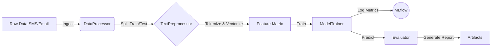

# NLP Spam Detection Pipeline


## Executive Summary
This project implements a modular, enterprise-grade Natural Language Processing (NLP) pipeline designed to detect spam across varying communication mediums (SMS and Email). 

Moving beyond experimental notebooks, this repository demonstrates a **production-first architecture**. It addresses the specific challenges of text classification: high dimensionality, domain shift (the difference between SMS and Email vocabulary), and the trade-off between Precision and Recall.

The final system achieves **~95% F1-Score** on combined datasets using a Linear SVC architecture with TF-IDF vectorization, orchestrated via MLflow for experiment tracking.

---

## Architecture
The project adheres to "Separation of Concerns" principles. Below is the high-level data flow from raw text to model inference.


The codebase is organized into reusable class-based components:

* **`src/pipeline/data_processor.py`**: Handles data ingestion, cleaning, and splitting. Manages the complexity of merging disparate datasets (SMS vs. Email).
* **`src/pipeline/text_preprocessor.py`**: A configurable engine for tokenization, normalization (casing), stop-word removal, and vectorization (Bag of Words vs. TF-IDF).
* **`src/pipeline/model_trainer.py`**: Wraps Scikit-Learn estimators with MLflow auto-logging, handling hyperparameter injection and model persistence.
* **`src/pipeline/evaluator.py`**: Calculates comprehensive metrics (Precision, Recall, F1) and generates artifact visualizations (Confusion Matrices).

---

## Key Insights & Performance Analysis

### 1. Model Selection & Efficiency 

[Model Performance Comparison](images/by_model.png)

We benchmarked four distinct architectures: Logistic Regression, Multinomial Naive Bayes, Linear SVC, and Random Forest.

**Performance Comparison**: *Result: Linear SVC and Logistic Regression performed comparably well in accuracy.*

[Training Duration Analysis](images/training_duration_by_model.png)

**Training Duration**: *Result: While Random Forest is robust, it is ~2x slower than Linear SVC. **Linear SVC** was chosen as the production model for its optimal speed-to-performance ratio.*

### 2. The "Domain Shift" Challenge (SMS vs. Email)
A critical experiment involved training on one domain and testing on another to evaluate model generalization.
* **SMS Trained $\to$ Email Tested:** Resulted in poor performance (Recall: ~0.385). The model learned SMS-specific slang (e.g., "txt", "free") but failed to recognize formal email spam patterns.
* **Combined Training $\to$ Email Tested:** Performance spiked to **~0.95 Precision/Recall**.
* **Insight:** Data diversity is more critical than model complexity. A simple model on diverse data beats a complex model on narrow data.

### 3. Feature Engineering Strategy
We performed extensive A/B testing on preprocessing configurations.

#### Vectorization (Count vs TF-IDF):
* **Insight**: **TF-IDF** (Pink) consistently outperformed standard Count Vectorization (Grey). By penalizing common words that appear in all documents, the model focuses on "rare" spam indicators.

#### Stop-Words Impact:
* **Insight**: Removing stop words (using NLTK) versus keeping them showed minimal difference in Accuracy, but keeping them slightly improved context in some edge cases.

[Vectorization Strategy Comparison](images/if_stop-words.png)

#### Optimization Trade-offs (Precision vs Recall):
* **Strategy**: In this iteration, `GridSearchCV` parameters resulted in a model biased towards **Recall** (Blue bars).
* **Business Logic**: We prioritized catching all spam (High Recall) at the cost of occasionally flagging legitimate emails. For a user-centric product, future iterations would re-balance for Precision.

[Optimization Strategy Results](images/if_optimize.png)

---

## Installation & Usage

### Prerequisites
* Python 3.10+
* `uv` (Python package manager)

### 1. Setup
Clone the repository and install dependencies:

```bash
uv sync
```

### 2. Running the Pipeline
The pipeline is triggered via the main entry point. You can run specific experiments or the full production flow.

- Run the standard training pipeline

```bash
uv run python scripts/run_pipeline
```

- Run the automatised wrappers for the standard pipeline

```bash
# For Grid Search
uv run python scripts/run_grid_search_pipeline.py

# For one or more exact parameters
uv run python scripts/run_automatic_pipeline.py
```

### 3. MLflow Tracking
To visualize experiment results, compare runs, and view artifacts (confusion matrices):

```bash
uv run mlflow ui
```

Then open `http://127.0.0.1:5000` in your browser.

---

## ⚙️ Pipeline Configuration

The pipeline is highly configurable via command-line arguments, allowing you to control every stage of the process from data selection to specific NLP preprocessing steps.

### General & Logging
| Argument | Default | Description |
| :--- | :--- | :--- |
| `--run_name` | `""` | Name tag for the MLflow run. If empty, defaults to general parameters and timestamp. |
| `--log-level` | `'normal'` | Controls console output. Options: `'silent'`, `'normal'`, `'verbose'`. |
| `--verbose` | `False` | **Deprecated**. Use `--log-level verbose` instead. |

### Data Selection
| Argument | Default | Options | Description |
| :--- |:--------| :--- | :--- |
| `--train_datasets` | `SMS`   | `SMS` `EMAIL` | Space-separated list of datasets to use for training. <br> *Example:* `--train_datasets SMS EMAIL` |
| `--test_datasets` | `SMS`   | `SMS` `EMAIL` | Space-separated list of datasets to use for testing. |

### Model & Optimization
| Argument | Default | Options                                                             | Description |
| :--- | :--- |:--------------------------------------------------------------------| :--- |
| `--model` | `'Logistic_Regression'` | `Logistic_Regression` `Linear_SVC` `MultinomialNB` `Random_Forest` `SGD_Classifier` | The architecture to use for the classifier. |
| `--optimize` | `False` | `True` / `False`                                                    | If set, enables `GridSearchCV` to find the best hyperparameters. **Note:** Increases runtime significantly. |

### NLP & Preprocessing
| Argument | Default | Description |
| :--- | :--- | :--- |
| `--vectorizer_type` | `None` | Method to convert text to feature vectors. Options: `'count'` (Bag of Words) or `'tfidf'`. |
| `--stop_words` | `None` | Specific list of stop words to remove during tokenization. |
| `--lowercase` | `False` | Flag to convert all text to lowercase before vectorization. |
| `--remove_punctuation`| `False` | Flag to strip all punctuation marks. |
| `--number_placeholder`| `False` | Flag to replace all digits with a generic `<NUM>` token to generalize numerical patterns. |

### Example Configurations

**1. Quick Baseline (SMS only, default settings):**
```bash
uv run python scripts/run_pipeline.py --model Logistic_Regression --train_datasets SMS --test_datasets SMS
```

## 📂 Project Structure

```text
.
├── images/                    # Project visualizations
├── mlruns/                    # MLflow experiment tracking store
├── scripts/                   # Execution entry points
│   ├── run_automatic_pipeline.py
│   ├── run_grid_search_pipeline.py
│   └── run_pipeline.py
├── src/
│   ├── pipeline/              # Core Logic
│   │   ├── data_processor.py
│   │   ├── evaluator.py
│   │   ├── model_trainer.py
│   │   └── text_preprocessor.py
│   └── utils/                 # Utilities
│       ├── config.py
│       ├── logger.py
│       └── parse_args.py
├── tests/                     # Unit tests
├── uv.lock
└── README.md
```

---

## Future Improvements
* **Deep Learning:** Integrate BERT/DistilBERT transformers to better capture context beyond simple keyword frequency.
* **API Deployment:** Wrap the `inference` method in a FastAPI container for real-time scoring.
* **Feedback Loop:** Implement a mechanism to retrain the model on False Positives identified by users to improve Precision over time.

---

**Authors:** 
- **Pierre-Antoine HIGNARD**, for everything
- **Samuel VATON**, for nothing
- **François-Xavier COLLOT**, for nothing


**Course:** UE Data Science Toolkits - NPL Spam Detection project